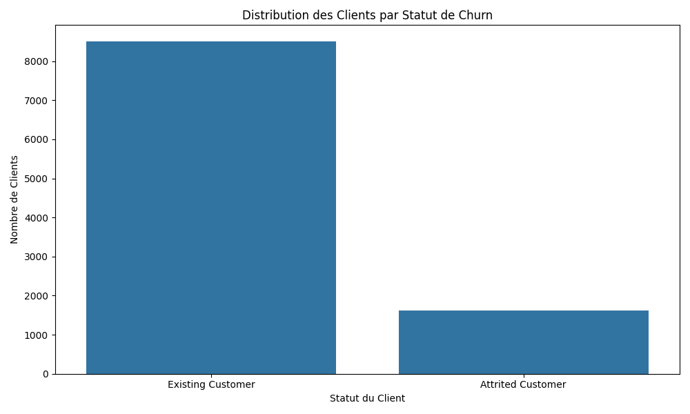
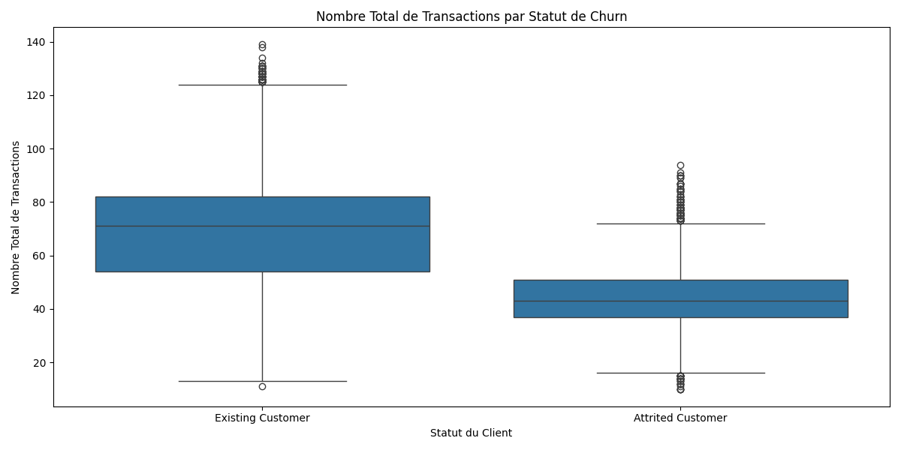
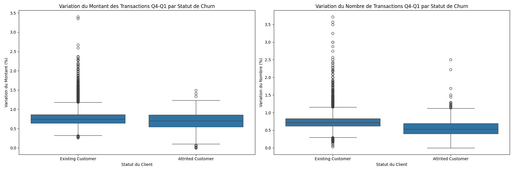
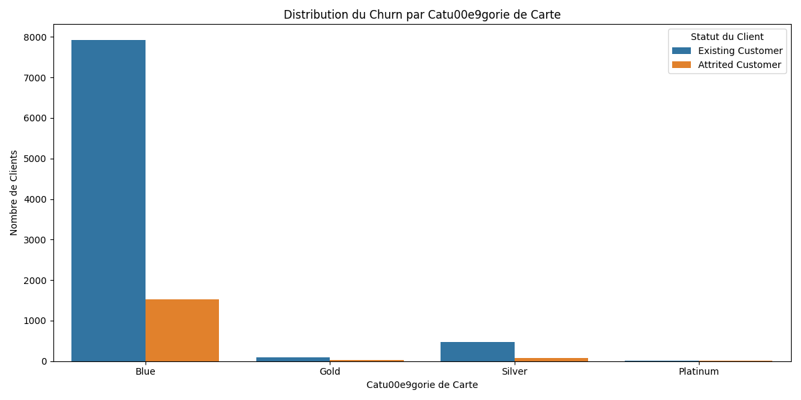
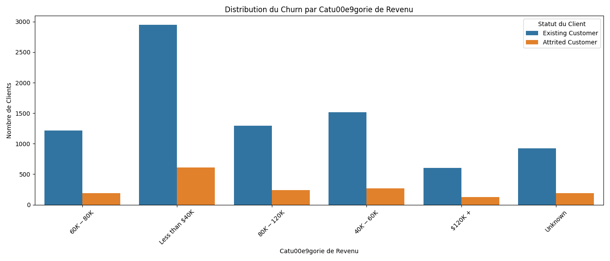
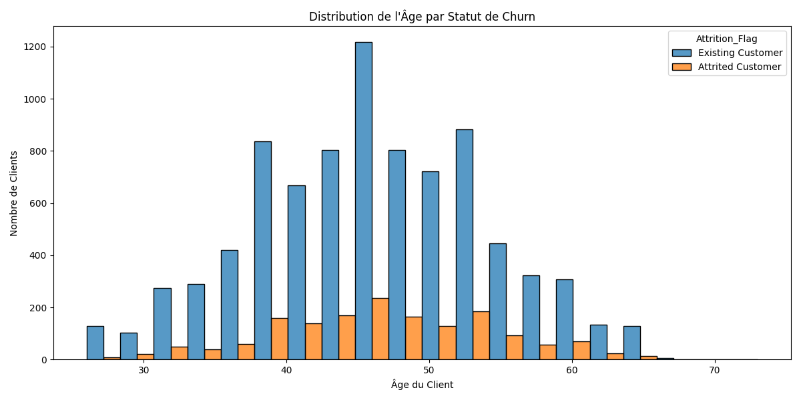
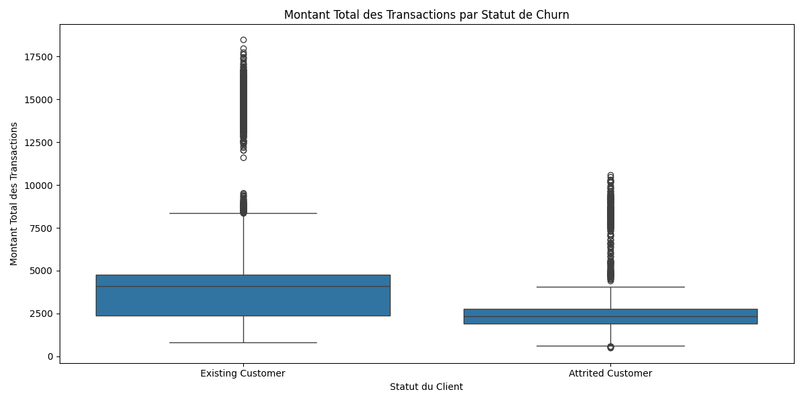
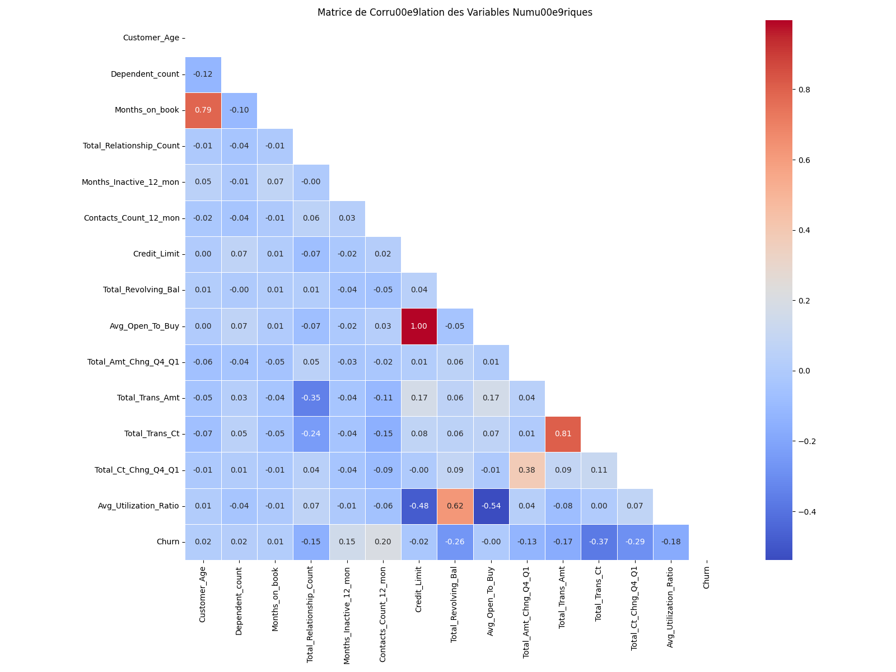
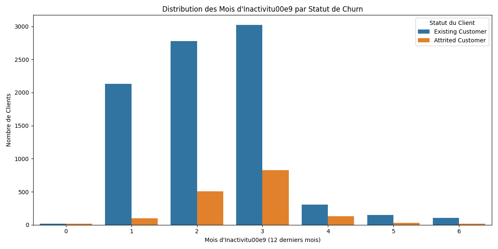
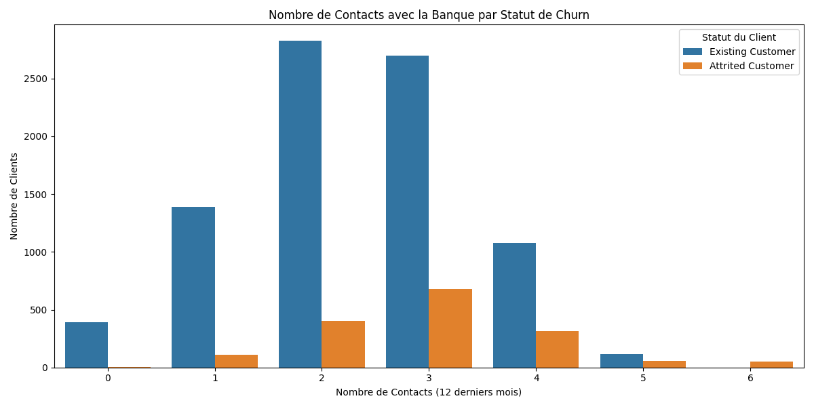

# Analyse et Pru00e9diction du Churn des Clients Bancaires

## Introduction

Ce projet analyse les donnu00e9es des clients d'une banque pour pru00e9dire le du00e9part (churn) des clients avant qu'il ne se produise. Le churn client repru00e9sente un du00e9fi majeur pour les institutions financiu00e8res, car l'acquisition de nouveaux clients est gu00e9nu00e9ralement plus cou00fbteuse que la ru00e9tention des clients existants.

## Donnu00e9es

Le jeu de donnu00e9es (`bank_churners.csv`) contient des informations sur les clients d'une banque et leurs comportements, incluant:

- Informations du00e9mographiques (u00e2ge, genre, situation familiale, niveau d'u00e9ducation)
- Relations avec la banque (duru00e9e de la relation, nombre de produits)
- Activitu00e9 du compte (transactions, inactivitu00e9)
- Utilisation de cru00e9dit (limite de cru00e9dit, solde renouvelable)

La variable cible est `Attrition_Flag` qui indique si un compte a u00e9tu00e9 fermu00e9 (churned) ou est toujours ouvert.

## Objectifs

1. Ru00e9aliser une u00e9tude pru00e9alable des donnu00e9es
2. Entrau00eener un modu00e8le appropriu00e9 et u00e9valuer ses performances (sans utiliser Bagging, RandomForest ou ru00e9seaux de neurones)
3. Optimiser l'approche avec:
   - Ru00e9duction de dimensions par PCA
   - Optimisation des hyperparamu00e8tres par GridSearch
   - Utilisation de modu00e8les avancu00e9s (Bagging, RandomForest ou Boosting)

## Visualisations Clu00e9s

### Distribution du Churn



La distribution des clients par statut de churn montre que environ 16% des clients ont quittu00e9 la banque ("Attrited Customer"), tandis que 84% sont restu00e9s ("Existing Customer"). Ce du00e9su00e9quilibre est typique des problu00e8mes de churn.

### Transactions et Churn



Cette visualisation ru00e9vu00e8le l'une des relations les plus significatives: les clients qui quittent la banque ont tendance u00e0 effectuer significativement moins de transactions que ceux qui restent.

### Variations d'Activitu00e9 et Churn



Ces graphiques montrent un insight critique: les clients qui quittent la banque pru00e9sentent gu00e9nu00e9ralement une plus faible augmentation (ou mu00eame une diminution) de leur activitu00e9 entre le premier et le quatriu00e8me trimestre, tant en termes de montant que de nombre de transactions.

## Mu00e9thodologie

### Partie 1: Modu00e8le de Base

- Exploration et pru00e9traitement des donnu00e9es
- Encodage des variables catu00e9gorielles
- Normalisation des variables numu00e9riques
- Entrau00eenement de plusieurs modu00e8les (Ru00e9gression Logistique, SVM, KNN, Decision Tree)
- u00c9valuation par validation croisu00e9e

### Partie 2: Optimisation

- Application de PCA pour ru00e9duire les dimensions
- Utilisation de GridSearch pour optimiser les hyperparamu00e8tres
- Entrau00eenement de modu00e8les plus avancu00e9s (GradientBoosting)
- Comparaison des performances

## Ru00e9sultats

### Exploration des Donnu00e9es

- Le dataset contient plus de 10 000 clients
- Le taux de churn est d'environ 16-17%
- Les variables comme le nombre total de transactions, le montant des transactions et les variations d'activitu00e9 entre trimestres sont fortement corru00e9lu00e9es avec le churn

### Performance des Modu00e8les

- Le modu00e8le de base (Ru00e9gression Logistique) obtient un score AUC d'environ 0.92
- L'utilisation de PCA maintient des performances similaires tout en ru00e9duisant la complexitu00e9
- Le modu00e8le optimisu00e9 (GradientBoosting) amu00e9liore les performances avec un score AUC supu00e9rieur u00e0 0.95

### Caractu00e9ristiques Importantes

Les facteurs les plus pru00e9dictifs du churn client incluent:
1. Total_Trans_Ct (nombre total de transactions)
2. Total_Revolving_Bal (montant du cru00e9dit u00e0 la consommation)
3. Total_Amt_Chng_Q4_Q1 (u00e9volution du montant des transactions)
4. Total_Ct_Chng_Q4_Q1 (u00e9volution du nombre de transactions)
5. Contacts_Count_12_mon (nombre de contacts avec la banque)

## Analyse Du00e9taillu00e9e avec Visualisations

### Facteurs Du00e9mographiques

#### Churn par Catu00e9gorie de Carte



La visualisation montre que le taux de churn varie selon la catu00e9gorie de carte. Les titulaires de cartes Blue repru00e9sentent la majoritu00e9 des clients et des churners, mais le taux de churn proportionnel est plus u00e9levu00e9 pour certaines catu00e9gories premium.

#### Churn par Catu00e9gorie de Revenu



La relation entre le niveau de revenu et le churn ru00e9vu00e8le des tendances intu00e9ressantes. Les clients u00e0 faible revenu ("Less than $40K") sont les plus nombreux u00e0 quitter la banque en termes absolus.

#### Distribution de l'u00c2ge par Statut de Churn



L'analyse de l'u00e2ge des clients montre que le churn touche toutes les tranches d'u00e2ge, avec une lu00e9gu00e8re surrepru00e9sentation dans certains groupes d'u00e2ge.

### Facteurs Comportementaux

#### Montant des Transactions et Churn



De mu00eame que pour le nombre de transactions, le montant total des transactions est gu00e9nu00e9ralement plus faible parmi les clients qui finissent par quitter la banque.

#### Matrice de Corru00e9lation



La matrice de corru00e9lation permet d'identifier les relations linu00e9aires entre les variables numu00e9riques. On observe notamment de fortes corru00e9lations entre le nombre de transactions et le montant des transactions, ainsi qu'entre la limite de cru00e9dit et le montant d'achat ouvert moyen.

#### Inactivitu00e9 et Churn



La pu00e9riode d'inactivitu00e9 est fortement liu00e9e au churn. Les clients qui ont u00e9tu00e9 inactifs pendant 3 mois ou plus au cours de la derniu00e8re annu00e9e sont beaucoup plus susceptibles de quitter la banque.

#### Contacts avec la Banque et Churn



Cette visualisation ru00e9vu00e8le un insight contre-intuitif: les clients qui contactent fru00e9quemment la banque sont plus susceptibles de partir. Cela pourrait indiquer des problu00e8mes non ru00e9solus ou des insatisfactions.

## Conclusion

Cette analyse du00e9montre qu'il est possible de pru00e9dire efficacement le churn des clients bancaires en utilisant des techniques de machine learning. Le modu00e8le optimisu00e9 permet d'identifier les clients u00e0 risque de du00e9part, ce qui permet u00e0 la banque de mettre en place des stratu00e9gies de ru00e9tention ciblu00e9es.

Les caractu00e9ristiques les plus importantes et les visualisations ru00e9vu00e8lent que:

1. **La baisse d'activitu00e9 transactionnelle** est un signal d'alarme majeur (nombre et montant des transactions)
2. **Les variations d'activitu00e9 entre trimestres** sont des pru00e9dicteurs cruciaux du churn
3. **L'inactivitu00e9 prolongu00e9e** sur plusieurs mois est fortement corru00e9lu00e9e au churn
4. **Les contacts fru00e9quents avec la banque** peuvent indiquer des problu00e8mes sous-jacents conduisant au churn

Ces insights peuvent guider des stratu00e9gies de fidu00e9lisation client proactives, en particulier pour les segments identifiu00e9s comme u00e9tant u00e0 haut risque.

## Exu00e9cution

Pour exu00e9cuter l'analyse complu00e8te:

```bash
python churn_analysis.py
```

Pour gu00e9nu00e9rer les visualisations uniquement:

```bash
python generate_visualizations.py
```

## Du00e9pendances

- pandas
- numpy
- matplotlib
- seaborn
- scikit-learn