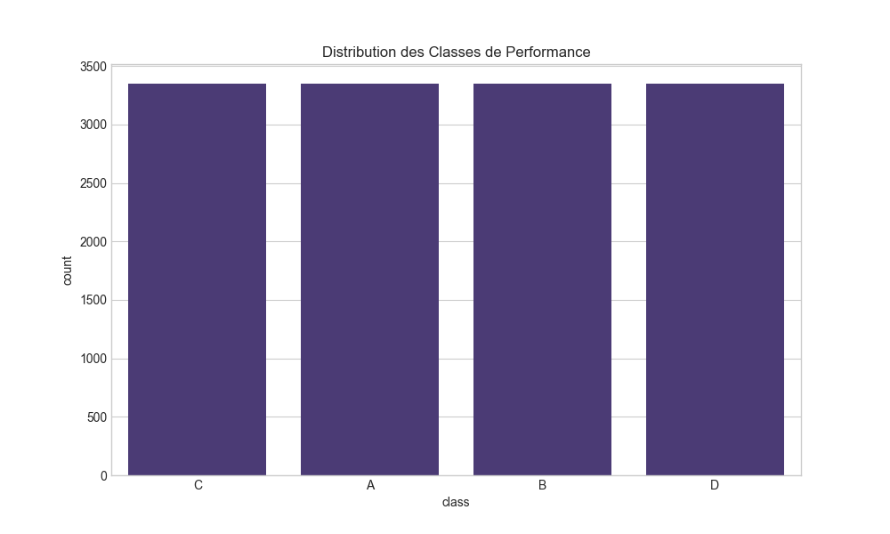
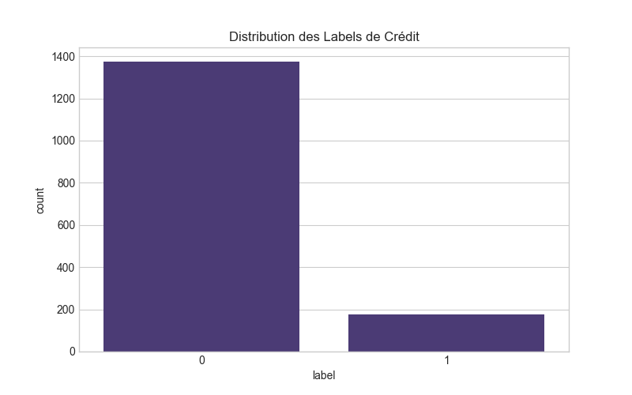
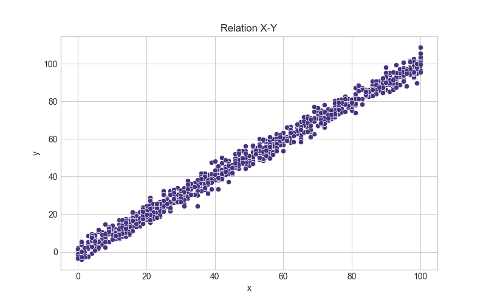
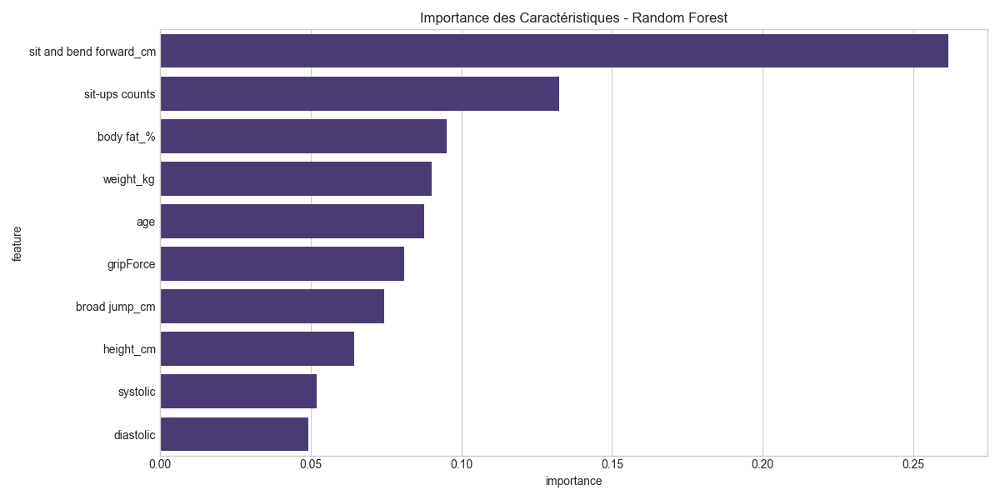
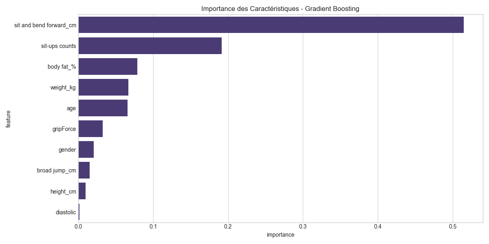
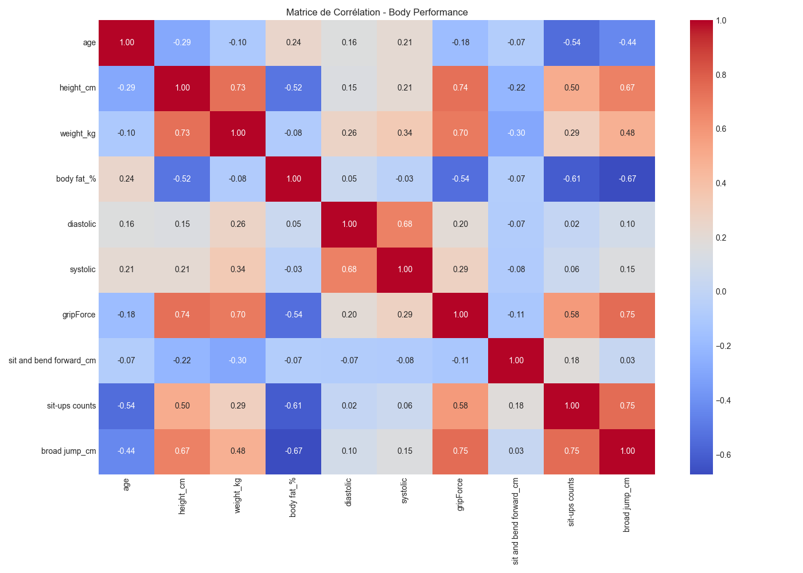
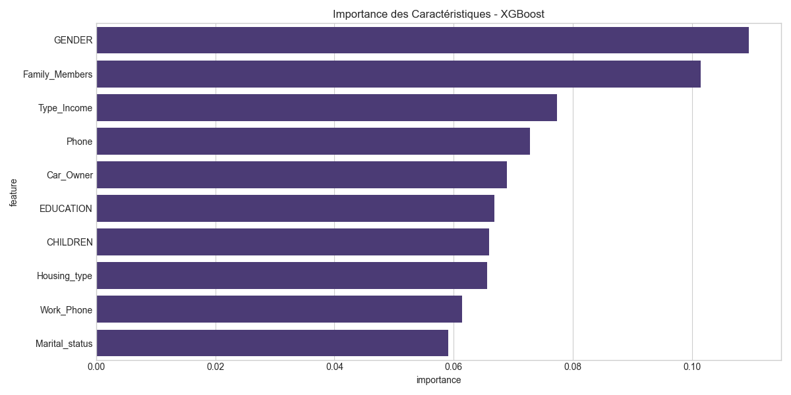
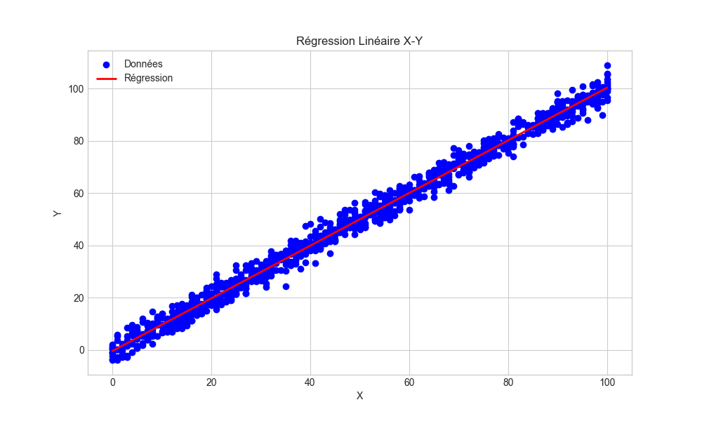

# Gym

## Description du Projet

Ce projet réalise une analyse complète de plusieurs jeux de données avec différentes approches de machine learning. Il explore trois datasets distincts, effectue un prétraitement adapté à chaque cas, et applique des modèles appropriés pour résoudre des problèmes de classification et de régression.

## Datasets

### 1. Body Performance Dataset (`body_performance.csv`)
- **Description**: Données de performances physiques d'individus (13393 entrées).
- **Variables d'entrée**: âge, genre, taille, poids, pourcentage de graisse corporelle, tension artérielle, force de préhension, flexibilité, redressements, saut en longueur.
- **Variable cible**: classe de performance (A, B, C, D) - distribution équilibrée (~3348 instances par classe).
- **Type de problème**: Classification multiclasse.



### 2. Credit Card Dataset (`credit_card.csv` et `credit_card_label.csv`)
- **Description**: Données démographiques et financières pour la prédiction d'octroi de crédit (1548 entrées).
- **Variables d'entrée**: genre, propriété de voiture, propriété immobilière, revenu annuel, éducation, statut marital, etc.
- **Variable cible**: approbation de crédit (binaire: 0 ou 1) - distribution déséquilibrée (1373 non approuvés vs 175 approuvés).
- **Type de problème**: Classification binaire avec déséquilibre de classes.



### 3. X-Y Dataset (`x_y.csv`)
- **Description**: Un jeu de données simple avec deux variables numériques (1000 entrées).
- **Type de problème**: Régression linéaire.



## Installation et Configuration

1. Cloner le repository:
   ```bash
   git clone https://github.com/kbrdn1/machine-learning
   cd machine-learning
   ```

2. Créer et activer un environnement virtuel:
   ```bash
   # Création de l'environnement virtuel
   python -m venv ml_env

   # Activation (Windows)
   ml_env\Scripts\activate

   # Activation (macOS/Linux)
   source ml_env/bin/activate
   ```

3. Installer les dépendances:
   ```bash
   pip install pandas numpy matplotlib seaborn scikit-learn xgboost imbalanced-learn
   ```

## Exécution du Code

Pour lancer l'analyse complète:
```bash
python ml1.py
```

Le script effectuera automatiquement:
- L'exploration des données
- Le prétraitement et la normalisation
- L'entraînement des modèles
- L'évaluation des performances
- La génération de visualisations

## Résultats

### Body Performance Dataset
- **Modèles utilisés**:
  - Random Forest (précision ~75%, meilleur F1-score pour classe D: 0.86)
  - Gradient Boosting (précision ~73%, meilleur F1-score pour classe D: 0.84)
- **Observations principales**:
  - Les caractéristiques les plus importantes sont la flexibilité (sit and bend forward), le nombre de redressements assis et le pourcentage de graisse corporelle
  - Les classes A et D sont mieux prédites que B et C qui présentent plus de confusion





### Credit Card Dataset
- **Modèles utilisés**:
  - Régression Logistique (précision: 0.57, AUC-ROC: 0.598)
  - XGBoost (précision: 0.91, AUC-ROC: 0.823)
- **Observations principales**:
  - XGBoost surpasse significativement la régression logistique
  - Les variables les plus prédictives sont le genre (GENDER), le nombre de membres de la famille (Family_Members) et le type de revenu (Type_Income)
  - La technique SMOTE a permis d'équilibrer les classes (1098 instances de chaque classe après rééchantillonnage)



### X-Y Dataset
- **Modèle utilisé**:
  - Régression linéaire
- **Observations principales**:
  - Une valeur manquante détectée dans 'y'
  - Modèle très performant avec MSE: 9.004 et R²: 0.989
  - Coefficient: 1.007, Intercept: -0.394



## Structure du Projet

```
.
├── dataset/                         # Dossier contenant tous les jeux de données
│   ├── body_performance.csv         # Dataset performance physique
│   ├── credit_card.csv              # Dataset crédit (caractéristiques)
│   ├── credit_card_label.csv        # Dataset crédit (labels)
│   └── x_y.csv                      # Dataset simple X-Y
├── ml1.py                           # Script principal d'analyse
├── body_performance_correlation.png # Matrice de corrélation - Body Performance
├── body_performance_class_distribution.png # Distribution des classes - Body Performance
├── body_rf_feature_importance.png   # Importance caractéristiques - Random Forest
├── body_gb_feature_importance.png   # Importance caractéristiques - Gradient Boosting
├── credit_card_label_distribution.png # Distribution des labels - Credit Card
├── credit_xgb_feature_importance.png # Importance caractéristiques - XGBoost
├── xy_scatter.png                   # Données de régression X-Y
├── xy_regression.png                # Résultats de régression X-Y
└── README.md                        # Documentation du projet
```

## Améliorations Possibles

1. **Optimisation des hyperparamètres**:
   - Utiliser GridSearchCV ou RandomizedSearchCV pour trouver les meilleurs paramètres pour chaque modèle

2. **Traitement des données avancé**:
   - Tester différentes techniques de gestion des valeurs manquantes
   - Explorer d'autres méthodes de feature engineering

3. **Modèles supplémentaires**:
   - Tester des modèles de deep learning pour les datasets complexes
   - Expérimenter avec des ensembles de modèles (stacking/blending)

4. **Validation croisée**:
   - Implémenter une validation croisée k-fold pour une évaluation plus robuste des modèles

## Conclusion

Cette analyse démontre l'importance d'adapter les modèles au type de données et au problème à résoudre. Pour le dataset de performance physique, les modèles basés sur les arbres de décision sont efficaces mais montrent des confusions entre classes similaires. Pour l'analyse de crédit, XGBoost surpasse nettement la régression logistique et gère bien le déséquilibre des classes grâce à SMOTE. Pour la régression X-Y, un modèle linéaire simple offre d'excellentes prédictions avec un R² proche de 1.

Le prétraitement des données, notamment la gestion des valeurs manquantes dans le dataset de crédit et la détection d'une valeur manquante dans le dataset X-Y, a été crucial pour la qualité des résultats.